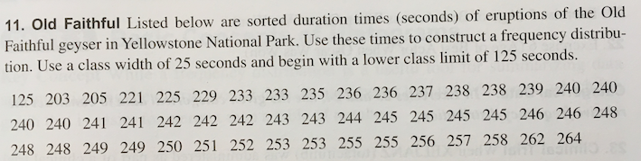
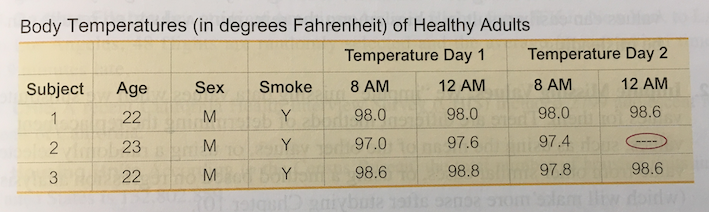
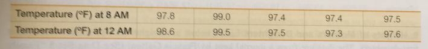
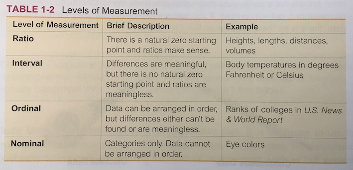

## GAISE 2016

1. Teach statistical thinking.
    * Teach statistics as an **investigative process** of problem-solving and 
    **decision-making**.
    * Give students experience with 
    **multivariable thinking**.
    
2. Focus on conceptual understanding.

3. Integrate **real data** 
   with a **context** and **purpose**.

4. Foster **active learning**.

5. Use **technology** 
   to explore concepts and analyze data.

6. Use **assessments** to improve and evaluate student learning.

## Real data

The [StatPREP definition](http://statprep.org/wp-content/uploads/2019/02/Spring-Newsletter-02.11.19.pdf):

* **captured in the wild**: not collected for teaching statistics
* **appropriate for investigation** of a particular question or set of questions
    * large enough (think: $n \ge 1000$)
    * rich enough (think: 5 or more variables)

For the moment, put aside the important matters of **context** and **purpose**.

Instead, focus on  the **organization** of data in a way that will contribute to 

* good habits in the workplace
* ability to use technology effectively
* multivariable thinking

Discipline in presenting data encourages good work habits.

# Data organization

## Data organization

* Almost all StatPREP participants say they teach little or nothing 
about organizing data.
* In textbooks, teaching about data focusses on variable types, 
    not organization. 
* Organizing data properly is critically important for ...
    - **thinking** correctly with data
    - using real data with **technology**
   
## "Database Thinking" 

<!-- - providing modern views of data -->
<!-- - structuring data collection effectively -->
* Ironically, this is a very mathematical form of thinking, 
    but few mathematicians know about it. 
* **SQL** is the algebra that **gets you a job** 
<!-- Or, for people who don't like a "vocational" emphasis:  -->
* Data base thinking $\to$ **explore and present both simple and complex data**
* Fundamental to data science
 
## Unruly data
 
**unruly**: (adj.) disorderly and disruptive and not amenable to discipline or control

## Unruly data
 
**unruly**: (adj.) disorderly and disruptive and not amenable to discipline or control

### Example 1 

## Unruly data
 
**unruly**: (adj.) disorderly and disruptive and not amenable to discipline or control

### Example 2

## Rules tame unruliness 

1. Always in a "**spreadsheet**" (ie, rows and columns, electronic) 
    [*fail*](https://ecstatic-mclean-a0b3e0.netlify.com/blog/fail/#no-spreadsheet) ✔︎✔︎✔︎
2. **Rows**: One row per unit of observation/analysis
    - No other info (e.g. summaries, codebook info) in 
    spreadsheet [*fail*](https://ecstatic-mclean-a0b3e0.netlify.com/blog/fail/#no-annotations)
    - *Any subset of rows is a valid data set.*
3. **Columns**: One column per variable [*fail*](https://ecstatic-mclean-a0b3e0.netlify.com/blog/fail/#no-columns) 
    - Always use column names [*fail*](https://ecstatic-mclean-a0b3e0.netlify.com/blog/fail/#no-column-names) 
4. Always have a **codebook** [*fail*](https://ecstatic-mclean-a0b3e0.netlify.com/blog/fail/#no-codebook)
    - Rows: how cases were selected
    - Columns: units, specific questions/protocols/methods
5. **Segregate data** collection and data analysis 
    - Never change the original data as part of the analysis
    
## Rules tame unruliness 

1. Always in a "**spreadsheet**" (ie, rows and columns) [*fail*](https://ecstatic-mclean-a0b3e0.netlify.com/blog/fail/#no-spreadsheet) ✔︎✔︎✔︎
2. **Rows**: One row per unit of observation/analysis
3. **Columns**: One column per variable [*fail*](https://ecstatic-mclean-a0b3e0.netlify.com/blog/fail/#no-columns) 
4. Always have a **codebook** [*fail*](https://ecstatic-mclean-a0b3e0.netlify.com/blog/fail/#no-codebook)
5. **Segregate data** collection and data analysis 
    
*Note: This sort of tidy/rectangular data is not the only kind of data, but it is an extremely important kind of data and sufficient for introductory courses.*

## Implications 

### You need to have a way to distribute such data.

- Google spreadsheets, google forms
    - [Best practices](https://www.benlcollins.com/spreadsheets/data-best-practices/)

- CSV files

- More efficient forms

# Operations on Tidy Data

## Tidy Data Admits Standard Data Operations

One advantage of tidy data is that it is ammenable to 
**standard, reusable data operations**.

## Data Operations: Fundamental

- **summarize** / **reduce**: convert entire data set to 1-row of summary values
    - in spreadsheet: often not tidy, summary formulas can be placed in untidy places
    - in R: `df_stats()`
    

- **mutate** / **transform**: add new variable
    - in spreadsheet: add a new column
    - in R: `mutate()`
    

- **filter**: remove/ignore rows or columns
    - in spreadsheet: ["hide" data](https://support.google.com/docs/answer/3540681)
    - in R: `filter()`

## Data Operations: Superficial

- **select**: remove/ignore columns
    - in spreadsheet: ["hide" data](https://support.google.com/docs/answer/3540681)
    - in R: `select()` 
    

- **arrange**
    - in spreadsheet, "sort". But how do you do this without altering the data?
    - in R: `arrange()`

## Data Operations: Profound 

- **group**: handle summarize and mutate in a groupwise way
    - in spreadsheet: [pivot table](https://support.google.com/docs/answer/1272900)
    - in R: `group_by()`; formulas  (eg, `blood_pressure ~ age + sex`)

- **join**: bring together data from multiple sources
    - in spreadsheet ["fusion tables"](https://support.google.com/fusiontables/answer/171254?hl=en) but will be [phased out in Dec. 2019 in terms of SQL operations](https://support.google.com/fusiontables/answer/9185417)
    

- **spread** / **gather**: change unit of analysis
    - in spreadsheet [pivot/unpivot](https://eagereyes.org/basics/spreadsheet-thinking-vs-database-thinking) 
    - in R: `spread()`, `gather()` [soon to be `pivot_wide()`, `pivot_long()`]

## Long vs Wide Data

<table class="table table-striped table-hover table-responsive" style="margin-left: auto; margin-right: auto;">
 <thead>
  <tr>
   <th style="text-align:left;"> country </th>
   <th style="text-align:left;"> continent </th>
   <th style="text-align:right;"> year </th>
   <th style="text-align:right;"> lifeExp </th>
  </tr>
 </thead>
<tbody>
  <tr>
   <td style="text-align:left;"> Afghanistan </td>
   <td style="text-align:left;"> Asia </td>
   <td style="text-align:right;"> 1952 </td>
   <td style="text-align:right;"> 28.801 </td>
  </tr>
  <tr>
   <td style="text-align:left;"> Afghanistan </td>
   <td style="text-align:left;"> Asia </td>
   <td style="text-align:right;"> 1957 </td>
   <td style="text-align:right;"> 30.332 </td>
  </tr>
  <tr>
   <td style="text-align:left;"> Afghanistan </td>
   <td style="text-align:left;"> Asia </td>
   <td style="text-align:right;"> 1962 </td>
   <td style="text-align:right;"> 31.997 </td>
  </tr>
  <tr>
   <td style="text-align:left;"> Afghanistan </td>
   <td style="text-align:left;"> Asia </td>
   <td style="text-align:right;"> 1967 </td>
   <td style="text-align:right;"> 34.020 </td>
  </tr>
</tbody>
</table>

 

<table class="table table-striped table-hover table-responsive" style="margin-left: auto; margin-right: auto;">
 <thead>
  <tr>
   <th style="text-align:left;"> country </th>
   <th style="text-align:left;"> continent </th>
   <th style="text-align:right;"> pop1952 </th>
   <th style="text-align:right;"> pop1957 </th>
   <th style="text-align:right;"> pop1962 </th>
   <th style="text-align:right;"> pop1967 </th>
   <th style="text-align:right;"> pop1972 </th>
   <th style="text-align:right;"> pop1977 </th>
   <th style="text-align:right;"> pop1982 </th>
   <th style="text-align:right;"> pop1987 </th>
   <th style="text-align:right;"> pop1992 </th>
   <th style="text-align:right;"> pop1997 </th>
   <th style="text-align:right;"> pop2002 </th>
   <th style="text-align:right;"> pop2007 </th>
  </tr>
 </thead>
<tbody>
  <tr>
   <td style="text-align:left;"> Afghanistan </td>
   <td style="text-align:left;"> Asia </td>
   <td style="text-align:right;"> 28.801 </td>
   <td style="text-align:right;"> 30.332 </td>
   <td style="text-align:right;"> 31.997 </td>
   <td style="text-align:right;"> 34.020 </td>
   <td style="text-align:right;"> 36.088 </td>
   <td style="text-align:right;"> 38.438 </td>
   <td style="text-align:right;"> 39.854 </td>
   <td style="text-align:right;"> 40.822 </td>
   <td style="text-align:right;"> 41.674 </td>
   <td style="text-align:right;"> 41.763 </td>
   <td style="text-align:right;"> 42.129 </td>
   <td style="text-align:right;"> 43.828 </td>
  </tr>
  <tr>
   <td style="text-align:left;"> Albania </td>
   <td style="text-align:left;"> Europe </td>
   <td style="text-align:right;"> 55.230 </td>
   <td style="text-align:right;"> 59.280 </td>
   <td style="text-align:right;"> 64.820 </td>
   <td style="text-align:right;"> 66.220 </td>
   <td style="text-align:right;"> 67.690 </td>
   <td style="text-align:right;"> 68.930 </td>
   <td style="text-align:right;"> 70.420 </td>
   <td style="text-align:right;"> 72.000 </td>
   <td style="text-align:right;"> 71.581 </td>
   <td style="text-align:right;"> 72.950 </td>
   <td style="text-align:right;"> 75.651 </td>
   <td style="text-align:right;"> 76.423 </td>
  </tr>
  <tr>
   <td style="text-align:left;"> Algeria </td>
   <td style="text-align:left;"> Africa </td>
   <td style="text-align:right;"> 43.077 </td>
   <td style="text-align:right;"> 45.685 </td>
   <td style="text-align:right;"> 48.303 </td>
   <td style="text-align:right;"> 51.407 </td>
   <td style="text-align:right;"> 54.518 </td>
   <td style="text-align:right;"> 58.014 </td>
   <td style="text-align:right;"> 61.368 </td>
   <td style="text-align:right;"> 65.799 </td>
   <td style="text-align:right;"> 67.744 </td>
   <td style="text-align:right;"> 69.152 </td>
   <td style="text-align:right;"> 70.994 </td>
   <td style="text-align:right;"> 72.301 </td>
  </tr>
  <tr>
   <td style="text-align:left;"> Angola </td>
   <td style="text-align:left;"> Africa </td>
   <td style="text-align:right;"> 30.015 </td>
   <td style="text-align:right;"> 31.999 </td>
   <td style="text-align:right;"> 34.000 </td>
   <td style="text-align:right;"> 35.985 </td>
   <td style="text-align:right;"> 37.928 </td>
   <td style="text-align:right;"> 39.483 </td>
   <td style="text-align:right;"> 39.942 </td>
   <td style="text-align:right;"> 39.906 </td>
   <td style="text-align:right;"> 40.647 </td>
   <td style="text-align:right;"> 40.963 </td>
   <td style="text-align:right;"> 41.003 </td>
   <td style="text-align:right;"> 42.731 </td>
  </tr>
</tbody>
</table>

## Quiz

List the many ways in which this "table" violates the conventions for effective data organization.

## Variable types

These are often introduced as definitions before the student has any use for them. 

In stats book: 

## Variables Types

### Key distinction / minor distinctions

- **numerical**: interval, ratio, count, measure,  ...
- **categorical**: unordered, ordered
    

## Variable types in the wild

### Numerical 

* **quantities** (with **dimension** and **units**) --
* **times** and **dates**
* **counts** (natural numbers)
* ~~codes: codes represent discrete levels, not really numerical~~
    
<!-- it's worthwhile to be able to distinquish these special types -->
<!--     i. arbitrary origin (e.g. °F or °C) vs meaningful origin independent  -->
<!--     of the units, e.g.  counts, growth rates -->
<!--             - in graphics, make sure zero is on the axis! -->

## Variable types in the wild

### Categorical 

* "Two-sample" isn't (usually) two samples
    * one sample, two **variables**
    * categorical variable identifies the group
* Summarizing with proportions doesn't make categrical data numerical
* Fixed vs "Random" 
    * Fixed: data contains all levels of interest
    * Random: data represents a subset of/sample from levels of interest

<!-- ### Operations on variables -->

<!-- Some operations only make sense for certain types of variables -->

<!-- - sum / mean -->
<!--     - helps distinguish numerical codes from true numerical variables -->
<!--     - is sum meaningful? e.g. miles per gallon versus gallons per mile -->

<!-- ### Transformation variables -->

<!-- - ratio (only with natural origin): but how often are we doing ratio transformations in stats class? -->
<!-- - difference () -->
<!-- - sqrt, log, ... (only with natural origin) -->

